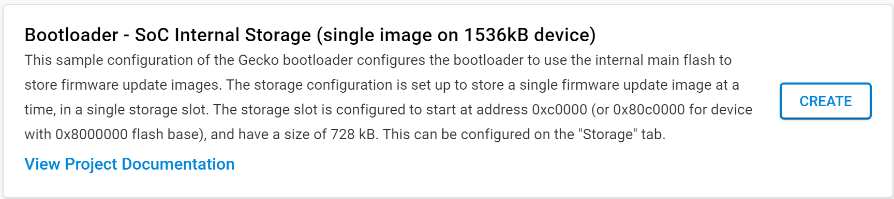
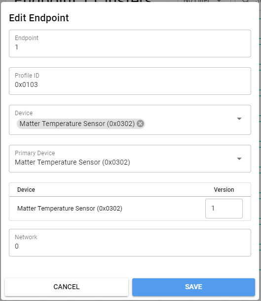

# Building a Matter Accessory Device based on Silicon Labs EFR32xG24 Dev Kit Board (BRD2601B)
### Author: [Olav Tollefsen](https://www.linkedin.com/in/olavtollefsen/)

## Introduction

This article shows how to modify the "Matter - SoC Sensor over Thread" example project with support for some of the sensors found on the Silicon Labs EFR32xG24 Dev Kit Board.

This article is based on Silicon Labs Gecko SDK version 4.4.0 with Silicon Labs Matter 2.2.0 extensions.


### What you will need

- A PC running Windows as the development workstation.
- Install Simplicity Studio V5 from Silicon Labs.
- Silicon Labs EFR32xG24 Dev Kit Board (BRD2601B).

This article assumes that you have already installed Simplicity Studio V5 and the Gecko SDK 4.4.0.

## Prepare the bootloader for Over-The-Air firmware upgrades

See this article for more details on Creating a Gecko Bootloader for Use in Matter OTA Software Update: https://docs.silabs.com/matter/2.0.0/matter-overview-guides/ota-bootloader

Find the "Bootloader - SoC Internal Storage (single image on 1536kB device)" example project and create a new project from it. This bootloader is for the Silicon Labs xG24-DK2601B EFR32xG24 Dev Kit, which has 1536kB Flash.



Open the .slcp file in your bootloader project and select "SOFTWARE COMPONENTS".

Install the "GBL Compression (LZMA)" component under Platform->Bootloader->Core:


Build the bootloader project, find the .s37 image file (under the Binaries folder) and flash it to your Silicon Labs Dev Kit.

## Create the initial project based on the "Matter - SoC Sensor over Thread" example project

Start by creating a new project in Simplicity Studio V5 by selecting the "Matter - SoC Sensor over Thread" example project and click "Create":


This is a good starting point as it already implements a fully functional Matter over Thread device. Unfortunately it only supports some simulated sensors and not the actual sensors found on the develkopment kit board.

## Change the default sensor type

When you create the sensor project it defaults to Occupancy Sensor. To switch between
the sensors, uninstall the 'Matter Occupancy Sensor'/current sensor component and install the
respective sensor component to enable it. One sensor component should be enabled for the app to build.

Open the .slcp file in your project and select "SOFTWARE COMPONENTS".

Navigate to "Silicon Labs Matter v2.2.0->Platform->Sensors:


Select the "Matter Temperature Sensor" component and click "Install".

Select the "Matter Temperature Sensor" component and click "Install".

When asked click on "Replace Matter Occupancy Sensor with Matter Temperature Sensor":


Select "Temperature Sensor Support" and click "Install".

Select the "Temperature Sensor Support" component and click "Install".

Select "Matter Occupancy Sensor" and click "Uninstall".

## Add support for on-board sensors

Open the .slcp file in your project and select "SOFTWARE COMPONENTS".

### Enable the hardware sensors

Locate the "Board Control" component under Platform->Board, select it and click on the Configure icon.


Make sure the relevant sensors are enabled:


### Add Board Drivers

Install the following drivers found under Platform->Board Drivers:

* BMP3xx - Pressure Sensor
* Pressure device driver for BMP3XX
* Si70xx - Temperature/Humidity Sensor
* VEML6035 - Ambient Light Sensor

### Add Matter Endpoints and Clusters for added sensor types

Open the config->common folder and open the file "temperature-thread-app.zap".

Select "Endpoint - 1" in the ZCL editor and select "Edit" as shown below.


Endpoint-1 should already be correctly setup for a Temperature sensor as shown below:



In the list of clusters on the right panel, expand the "Measurement & Sensing" section and find the "Temperature Measurement" cluster and click on the settings icon.


Click on the NULL button in the Default field for the MeasuredValue attribute.


Click Cancel.

#### Add Endpoint for Humidity Sensor

Click on "+ ADD ENDPOINT" to add another endpoint.

Fill in the information shown below and click "Save".


#### Add Endpoint for Light Sensor

Click on "+ ADD ENDPOINT" to add another endpoint.

Fill in the information shown below and click "Save".


#### Add Endpoint for Pressure Sensor

Click on "+ ADD ENDPOINT" to add another endpoint.

Fill in the information shown below and click "Save".


#### Add support for the Unit Localization Cluster


Add TemperatureUnit and set it to 1 = Celsius.


### Add C++ classes for the sensors

#### Create C++ classes for the BMP3xx - Pressure Sensor

Locate the "include" folder in the Simplicity Studio project, right click on it and select "New>Header File". Enter "BMP3xxPressureSensor.h" as the filname and make sure the "Default C++ header template" is selected and click "Finish".

Paste the following code into the new header file:

```
class BMP3xxPressureSensor
{

private:

  bool _isInitialized = false;

  public:

    BMP3xxPressureSensor();

    bool Init();

    bool MeasurePressure(float* pressure);

};
```

Locate the "src" folder in the Simplicity Studio project, right click on it and select "New>Source File". Enter "BMP3xxPressureSensor.cpp" as the filname and make sure the "Default C++ source template" is selected and click "Finish".

Paste the following code into the new source file:

```
#include "BMP3xxPressureSensor.h"
#include "sl_i2cspm_instances.h"
#include "sl_bmp3xx.h"

BMP3xxPressureSensor::BMP3xxPressureSensor()
{
}

bool BMP3xxPressureSensor::Init()
{
  if (_isInitialized)
    return true;

  int8_t result = sl_bmp3xx_init(sl_i2cspm_sensor);

  _isInitialized = (result == SL_STATUS_OK);

  return _isInitialized;
}

bool BMP3xxPressureSensor::MeasurePressure(float* pressureResult)
{
  if (!_isInitialized)
    return false;

  float pressure;

  // Returns pressure in Pascal
  int8_t result = sl_bmp3xx_measure_pressure(sl_i2cspm_sensor, &pressure);

  bool success = (result == SL_STATUS_OK);
  if (success)
  {
      // Convert to kiloPascal (kPa)
      *pressureResult = (pressure / 1000.0);
  }

  return success;
}
```

#### Create C++ classes for the Si70xx - Temperature/Humidity Sensor

Locate the "Include" folder in the Simplicity Studio project, right click on it and select "New>Header File". Enter "Si70xxTemperatureHumiditySensor.h" as the filname and make sure the "Default C++ header template" is selected and click "Finish".

Paste the following code into the new header file:

```
class Si70xxTemperatureHumiditySensor
{

private:

  bool _isInitialized = false;

  public:

    Si70xxTemperatureHumiditySensor();

    bool Init();

    bool MeasureRelativeHumidity(float* relativeHumidity);

    bool MeasureTemperature(float* temperature);

};
```

Locate the "src" folder in the Simplicity Studio project, right click on it and select "New>Source File". Enter "Si70xxTemperatureHumiditySensor.cpp" as the filname and make sure the "Default C++ source template" is selected and click "Finish".

Paste the following code into the new source file:

```
#include <cstddef>
#include "Si70xxTemperatureHumiditySensor.h"
#include "sl_i2cspm_instances.h"
#include "sl_si70xx.h"

Si70xxTemperatureHumiditySensor::Si70xxTemperatureHumiditySensor()
{
}

bool Si70xxTemperatureHumiditySensor::Init()
{
  if (_isInitialized)
    return true;

  sl_status_t sc;

  sc = sl_si70xx_init(sl_i2cspm_sensor, SI7021_ADDR);

  _isInitialized = (sc == SL_STATUS_OK);

  return _isInitialized;
}

bool Si70xxTemperatureHumiditySensor::MeasureRelativeHumidity(float* relativeHumidity)
{
  if (!_isInitialized)
    return false;

  sl_status_t sc;
  uint32_t rhData;
  int32_t tData;

  sc = sl_si70xx_measure_rh_and_temp(sl_i2cspm_sensor, SI7021_ADDR, &rhData, &tData);

  bool success = (sc == SL_STATUS_OK);

  if (success)
  {
    *relativeHumidity = (rhData / 1000.0);
  }

  return success;
}

bool Si70xxTemperatureHumiditySensor::MeasureTemperature(float* temperature)
{
  if (!_isInitialized)
    return false;

  sl_status_t sc;
  uint32_t rhData;
  int32_t tData;

  sc = sl_si70xx_measure_rh_and_temp(sl_i2cspm_sensor, SI7021_ADDR, &rhData, &tData);

  bool success = (sc == SL_STATUS_OK);

  if (success)
  {
      *temperature = (tData / 1000.0);
  }

  return success;
}
```

#### Create C++ classes for the VEML6035 - Ambient Light Sensor

Locate the "include" folder in the Simplicity Studio project, right click on it and select "New>Header File". Enter "VEML6035AmbientLightSensor.h" as the filname and make sure the "Default C++ header template" is selected and click "Finish".

Paste the following code into the new header file:

```
class VEML6035AmbientLightSensor
{

private:

  bool _isInitialized = false;

  public:

  VEML6035AmbientLightSensor();

    bool Init();

    bool MeasureIllumination(float* illumination);

};
```

Locate the "src" folder in the Simplicity Studio project, right click on it and select "New>Source File". Enter "VEML6035AmbientLightSensor.cpp" as the filname and make sure the "Default C++ source template" is selected and click "Finish".

Paste the following code into the new source file:

```
#include "VEML6035AmbientLightSensor.h"
#include "sl_i2cspm_instances.h"
#include "sl_veml6035.h"

VEML6035AmbientLightSensor::VEML6035AmbientLightSensor()
{
}

bool VEML6035AmbientLightSensor::Init()
{
  if (_isInitialized)
    return true;

  sl_status_t sc = sl_veml6035_init(sl_i2cspm_sensor, false);

  _isInitialized = (sc == SL_STATUS_OK);

  return _isInitialized;
}

bool VEML6035AmbientLightSensor::MeasureIllumination(float* lux)
{
  if(!_isInitialized) {
      return false;
  }

  sl_status_t sc = sl_veml6035_get_als_lux(sl_i2cspm_sensor, lux);

  bool success = (sc == SL_STATUS_OK);

  return success;
}
```

### Update example project to use the hardware sensors

Locate the "src" folder and open "SensorsCallbacks.cpp".

Replace the content of the source file with the following code:

```
#include "SensorsCallbacks.h"
#include "AppTask.h"
#include <platform/silabs/platformAbstraction/SilabsPlatform.h>

#include <app-common/zap-generated/attributes/Accessors.h>
#include <app-common/zap-generated/ids/Attributes.h>
#include <app-common/zap-generated/ids/Clusters.h>

#include "BMP3xxPressureSensor.h"
#include "Si70xxTemperatureHumiditySensor.h"
#include "VEML6035AmbientLightSensor.h"

using namespace ::chip::DeviceLayer::Silabs;

BMP3xxPressureSensor pressureSensor;
Si70xxTemperatureHumiditySensor temperatureHumiditySensor;
VEML6035AmbientLightSensor illuminanceSensor;

void SilabsSensors::InitSensor(void)
{
  illuminanceSensor.Init();
  pressureSensor.Init();
  temperatureHumiditySensor.Init();
}

void UpdateRelativeHumidityMeasurement()
{
  float measuredRelativeHumidity;
  if (temperatureHumiditySensor.MeasureRelativeHumidity(&measuredRelativeHumidity))
  {
      chip::DeviceLayer::PlatformMgr().LockChipStack();
      chip::app::Clusters::RelativeHumidityMeasurement::Attributes::MeasuredValue::Set(2, measuredRelativeHumidity * 100);
      chip::DeviceLayer::PlatformMgr().UnlockChipStack();
  }
}

void UpdateIlluminanceMeasurement()
{
  float measuredLux;
  if (illuminanceSensor.MeasureIllumination(&measuredLux))
  {
      chip::DeviceLayer::PlatformMgr().LockChipStack();
      chip::app::Clusters::IlluminanceMeasurement::Attributes::MeasuredValue::Set(3, measuredLux);
      chip::DeviceLayer::PlatformMgr().UnlockChipStack();
  }
}

void UpdateTemperatureMeasurement()
{
  float measuredTemperature;
  if (temperatureHumiditySensor.MeasureTemperature(&measuredTemperature))
  {
      chip::DeviceLayer::PlatformMgr().LockChipStack();
      chip::app::Clusters::TemperatureMeasurement::Attributes::MeasuredValue::Set(1, measuredTemperature * 100);
      chip::DeviceLayer::PlatformMgr().UnlockChipStack();
  }
}

void UpdatePressureMeasurement()
{
  float measuredPressure;
  if (pressureSensor.MeasurePressure(&measuredPressure))
  {
      chip::DeviceLayer::PlatformMgr().LockChipStack();
      chip::app::Clusters::PressureMeasurement::Attributes::MeasuredValue::Set(4, measuredPressure * 10);
      chip::DeviceLayer::PlatformMgr().UnlockChipStack();
  }
}

void UpdateMeasurements()
{
  UpdateIlluminanceMeasurement();
  UpdateRelativeHumidityMeasurement();
  UpdateTemperatureMeasurement();
  UpdatePressureMeasurement();
}

void SilabsSensors::ActionTriggered(AppEvent * aEvent)
{
  if (aEvent->Type == AppEvent::kEventType_Button)
  {
      if (aEvent->ButtonEvent.Action == static_cast<uint8_t>(SilabsPlatform::ButtonAction::ButtonPressed))
      {
          UpdateMeasurements();
      }
  }
  else if (aEvent->Type == AppEvent::kEventType_Timer)
  {
      UpdateMeasurements();
  }
}
```

You should now be able to build and test the Matter Accessory Device!

## Add support for a CO2 sensor using UART (serial communication)

To be able to connect the CO2 sensor to the EFR32xG24 Dev Kit Board, I soldered two 10-pin headers to the EXP headers on the board.

Connect TX from the CO2 sensor to RX on the EFR32xG24 Dev Kit Board and RX to TX. My CO2 sensor use 5V, so I connect those together and GND. It then looks like the photo on top of this article.

### Resolve conflict with "vcom"

There are no additional hardware resources availabe for additional RX / TX UART pins, so the existing use of these needs to be removed first. They are used by "vcom", which was added to support "Matter Shell".

#### Remove the Software Component Matter Shell

Open the .slcp file in your project and select "SOFTWARE COMPONENTS".

Search for "Matter Shell" and Uninstall it.

### Add support for UART to the project

Open the .slcp file in your project and select "SOFTWARE COMPONENTS".

Locate "Services->IO Stream->Driver->IO Stream: EUSART", select it and click "Install"


Select the name "exp" and click Done.

When the installation is completed click on "Instances":


Click on the gear icon to the right of "exp":

Make sure the settings are correct for  your CO2 sensor. I changed only the Baud rate to 9600.

### Add Matter cluster support for CO2-sensor

Open the config->common folder and open the file "temperature-thread-app.zap".

#### Add Endpoint for CO2 Sensor

Click on "+ ADD ENDPOINT" to add another endpoint.

Fill in the information shown below and click "Save".


With the new enpoint selected, click on "Measurement & Sensing" in the list of clusters.


The "Air Quality" and "Carbon Dioxide Concentration Measurement" should be "Server" enabled. The rest should be "Not Enabled".

Configure properties for the "Carbon Dioxide Concentration Measurement" cluster

Click the Settings icon for the "Carbon Dioxide Concentration Measurement" cluster


Enable the "MeasuredValue" attribute.


Set the ClusterRevision attribute to the default value 3.


Now Build the project

## Generate Matter Onboarding Codes (QR Code and Manual Pairing Code)

Note! The values used below are defined in "CHIPProjectConfig.h" found in the include folder of your project.

```
// Generate the QR Code
chip-tool payload generate-qrcode \
  --discriminator 3840 \
  --setup-pin-code 20202021 \
  --vendor-id 0xFFF1 \
  --product-id 0x8004 \
  --version 0 \
  --commissioning-mode 0 \
  --rendezvous 2
```

```
// Generates the short manual pairing code (11-digit).
chip-tool payload generate-manualcode \
  --discriminator 3840 \
  --setup-pin-code 20202021 \
  --version 0 \
  --commissioning-mode 0
```

```
// To generate a long manual pairing code (21-digit) that includes both the vendor ID and product ID,
// --commissioning-mode parameter must be set to either 1 or 2, indicating a non-standard commissioning flow.
chip-tool payload generate-manualcode \
  --discriminator 3840 \
  --setup-pin-code 20202021 \
  --vendor-id 0xFFF1 \
  --product-id 0x8004 \
  --version 0 \
  --commissioning-mode 1
```