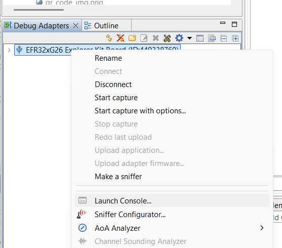

# Building a Matter Accessory Device based on Silicon Labs EFR32xG24 Dev Kit Board (BRD2601B)
### Author: [Olav Tollefsen](https://www.linkedin.com/in/olavtollefsen/)

## Introduction

This article shows how to modify the "Matter - SoC Sensor over Thread" example project with support for some of the sensors found on the Silicon Labs EFR32xG24 Dev Kit Board.

This article is based on Simplicity SDK Suite v2025.6.0 with Silicon Labs Matter 2.6.0 extensions (based on Matter version 1.4.1).


### What you will need

- A PC running Windows as the development workstation.
- Install Simplicity Studio V5 from Silicon Labs.
- Silicon Labs EFR32xG24 Dev Kit Board (BRD2601B).

This article assumes that you have already installed Simplicity Studio V5 and the Simplicity SDK Suite v2025.6.0 and Silicon Labs Matter 2.6.0.

## Enable long paths / filenames

To avoid issues with filename length restrictions, make sure to apply settings to support longer paths / filenames.

### Windows

https://learn.microsoft.com/en-us/windows/win32/fileio/maximum-file-path-limitation?tabs=registry#enable-long-paths-in-windows-10-version-1607-and-later

### Git

```
git config --system core.longpaths true
```

## Create a new project based on the "Matter - SoC Sensor over Thread with external Bootloader" Solution Example

Start by creating a new project in Simplicity Studio V5 by selecting the "Matter - SoC Sensor over Thread with external Bootloader" example solution project and click "Create":


This is a good starting point as it already implements a fully functional Matter over Thread device. Unfortunately it only supports some simulated sensors and not the actual sensors found on the develkopment kit board.

## Prepare the bootloader for Over-The-Air firmware upgrades

See this article for more details on Creating a Gecko Bootloader for Use in Matter OTA Software Update: https://docs.silabs.com/matter/2.0.0/matter-overview-guides/ota-bootloader

Open the .slcp file in your bootloader project and select "SOFTWARE COMPONENTS".

Make sure that the "GBL Compression (LZMA)" component under Platform->Bootloader->Core is installed:


Build the bootloader project, find the .s37 image file (under the Binaries folder) and flash it to your Silicon Labs Dev Kit.

## Change the OpenThread stack from Minimal Thread Device (MTD) to Full Thread Device (FTD)

If you have a mains powered device, you may want to change the OpenThread stack from Minimal Thread Device (MTD) to Full Thread Device (FTD) in order for the device to participate in routing of messages.

By default the sample is configured as a Minimal Thread Device.

Open the .slcp file in your project and select "SOFTWARE COMPONENTS".

Search for "FTD", select the "Stack (FTD") component and click on "Install".


When prompted to "Replace Stack (MTD) with Stack (FTD)" click OK.


## Remove unused sensor type

When you create the sensor project it defaults to Occupancy Sensor and Temperature sensor. We will not be used the occupancy sensor functionality, so uninstall the "Occupancy Sensing Server Cluster".

Search for "Occupancy" and uninstall the "Occupancy Sensing Server Cluster" component.

## Add support for on-board sensors

Open the .slcp file in your project and select "SOFTWARE COMPONENTS".

### Enable the hardware sensors

Locate the "Board Control" component under Platform->Board->Starter Kit, select it and click on the Configure icon.


Make sure the relevant sensors are enabled:


Optional: Enable Microphone

### Add Board Drivers

Install the following drivers found under Platform->Board Drivers:

* BMP3xx - Pressure Sensor
* Pressure device driver for BMP3XX
* Si70xx - Temperature/Humidity Sensor
* VEML6035 - Ambient Light Sensor
* Microphone (optional, not supported by Matter yet)

### Add Matter Endpoints and Clusters for added sensor types

Open the config->common folder and open the file "sensor-thread-app.zap".

By default the following endpoints are created:


Select "Endpoint - 1" in the ZCL editor and select "Delete" as shown below.


Select "Endpoint - 2" in the ZCL editor and select "Edit" as shown below.


Change the Endpoint setting for "Endpoint - 2" to 1 as shown below and click Save:


In the list of clusters on the right panel, expand the "Measurement & Sensing" section and find the "Temperature Measurement" cluster and click on the settings icon.


Click on the NULL button in the Default field for the MeasuredValue attribute.


Click the X in the upper right corner.

Select "Endpoint - 3" in the ZCL editor and select "Delete" as shown below.


#### Add Endpoint for Humidity Sensor

Click on "+ ADD ENDPOINT" to add another endpoint.

Fill in the information shown below and click "Save".


#### Add Endpoint for Light Sensor

Click on "+ ADD ENDPOINT" to add another endpoint.

Fill in the information shown below and click "Save".


#### Add Endpoint for Pressure Sensor

Click on "+ ADD ENDPOINT" to add another endpoint.

Fill in the information shown below and click "Save".


Change the settings for the Pressure Measurement cluster as follows:


#### Add support for the Unit Localization Cluster in "Endpoint - 0"

Select "Endpoint - 0" in the ZCL editor and enter "unit loc" in the search box:


Change the Enable field to "Server" and click on the Configure icon.

Add TemperatureUnit and set it to 1 = Celsius.


## Support for newer C++ versions

By default, the project will support "-std=gnu++17". Right click on the project and select "Properties". Then expand "C/C++ Build" and select "Settings". Expand "GNU ARM C++ Compiler" and select the desired C++ Language Dialect.

### Add C++ classes for the sensors

#### Create C++ classes for the BMP3xx - Pressure Sensor

Locate the "include" folder in the Simplicity Studio project, right click on it and select "New>Header File". Enter "BMP3xxPressureSensor.h" as the filname and make sure the "Default C++ header template" is selected and click "Finish".

Paste the following code into the new header file:

```
class BMP3xxPressureSensor
{

private:

  bool _isInitialized = false;

  public:

    BMP3xxPressureSensor();

    bool Init();

    bool MeasurePressure(float* pressure);

};
```

Locate the "src" folder in the Simplicity Studio project, right click on it and select "New>Source File". Enter "BMP3xxPressureSensor.cpp" as the filname and make sure the "Default C++ source template" is selected and click "Finish".

Paste the following code into the new source file:

```
#include "BMP3xxPressureSensor.h"
#include "sl_i2cspm_instances.h"
#include "sl_bmp3xx.h"

BMP3xxPressureSensor::BMP3xxPressureSensor()
{
}

bool BMP3xxPressureSensor::Init()
{
  if (_isInitialized)
    return true;

  int8_t result = sl_bmp3xx_init(sl_i2cspm_sensor);

  _isInitialized = (result == SL_STATUS_OK);

  return _isInitialized;
}

bool BMP3xxPressureSensor::MeasurePressure(float* pressureResult)
{
  if (!_isInitialized)
    return false;

  float pressure;

  // Returns pressure in Pascal
  int8_t result = sl_bmp3xx_measure_pressure(sl_i2cspm_sensor, &pressure);

  bool success = (result == SL_STATUS_OK);
  if (success)
  {
      // Convert to kiloPascal (kPa)
      *pressureResult = (pressure / 1000.0);
  }

  return success;
}
```

#### Create C++ classes for the Si70xx - Temperature/Humidity Sensor

Locate the "Include" folder in the Simplicity Studio project, right click on it and select "New>Header File". Enter "Si70xxTemperatureHumiditySensor.h" as the filname and make sure the "Default C++ header template" is selected and click "Finish".

Paste the following code into the new header file:

```
class Si70xxTemperatureHumiditySensor
{

private:

  bool _isInitialized = false;

  public:

    Si70xxTemperatureHumiditySensor();

    bool Init();

    bool MeasureRelativeHumidity(float* relativeHumidity);

    bool MeasureTemperature(float* temperature);

};
```

Locate the "src" folder in the Simplicity Studio project, right click on it and select "New>Source File". Enter "Si70xxTemperatureHumiditySensor.cpp" as the filname and make sure the "Default C++ source template" is selected and click "Finish".

Paste the following code into the new source file:

```
#include <cstddef>
#include "Si70xxTemperatureHumiditySensor.h"
#include "sl_i2cspm_instances.h"
#include "sl_si70xx.h"

Si70xxTemperatureHumiditySensor::Si70xxTemperatureHumiditySensor()
{
}

bool Si70xxTemperatureHumiditySensor::Init()
{
  if (_isInitialized)
    return true;

  sl_status_t sc;

  sc = sl_si70xx_init(sl_i2cspm_sensor, SI7021_ADDR);

  _isInitialized = (sc == SL_STATUS_OK);

  return _isInitialized;
}

bool Si70xxTemperatureHumiditySensor::MeasureRelativeHumidity(float* relativeHumidity)
{
  if (!_isInitialized)
    return false;

  sl_status_t sc;
  uint32_t rhData;
  int32_t tData;

  sc = sl_si70xx_measure_rh_and_temp(sl_i2cspm_sensor, SI7021_ADDR, &rhData, &tData);

  bool success = (sc == SL_STATUS_OK);

  if (success)
  {
    *relativeHumidity = (rhData / 1000.0);
  }

  return success;
}

bool Si70xxTemperatureHumiditySensor::MeasureTemperature(float* temperature)
{
  if (!_isInitialized)
    return false;

  sl_status_t sc;
  uint32_t rhData;
  int32_t tData;

  sc = sl_si70xx_measure_rh_and_temp(sl_i2cspm_sensor, SI7021_ADDR, &rhData, &tData);

  bool success = (sc == SL_STATUS_OK);

  if (success)
  {
      *temperature = (tData / 1000.0);
  }

  return success;
}
```

#### Create C++ classes for the VEML6035 - Ambient Light Sensor

Locate the "include" folder in the Simplicity Studio project, right click on it and select "New>Header File". Enter "VEML6035AmbientLightSensor.h" as the filname and make sure the "Default C++ header template" is selected and click "Finish".

Paste the following code into the new header file:

```
class VEML6035AmbientLightSensor
{

private:

  bool _isInitialized = false;

  public:

  VEML6035AmbientLightSensor();

    bool Init();

    bool MeasureIllumination(float* illumination);

};
```

Locate the "src" folder in the Simplicity Studio project, right click on it and select "New>Source File". Enter "VEML6035AmbientLightSensor.cpp" as the filname and make sure the "Default C++ source template" is selected and click "Finish".

Paste the following code into the new source file:

```
#include "VEML6035AmbientLightSensor.h"
#include "sl_i2cspm_instances.h"
#include "sl_veml6035.h"

VEML6035AmbientLightSensor::VEML6035AmbientLightSensor()
{
}

bool VEML6035AmbientLightSensor::Init()
{
  if (_isInitialized)
    return true;

  sl_status_t sc = sl_veml6035_init(sl_i2cspm_sensor, false);

  _isInitialized = (sc == SL_STATUS_OK);

  return _isInitialized;
}

bool VEML6035AmbientLightSensor::MeasureIllumination(float* lux)
{
  if(!_isInitialized) {
      return false;
  }

  sl_status_t sc = sl_veml6035_get_als_lux(sl_i2cspm_sensor, lux);

  bool success = (sc == SL_STATUS_OK);

  return success;
}
```

### Update example project to use the hardware sensors

Locate the "include" folder and open the file "SensorManager.h".

Replace the content of the source file with the following code:

```
/*
 * SensorManagerCustom.h
 *
 *  Created on: Dec 17, 2024
 *      Author: olavt
 */

#pragma once

#include <lib/core/CHIPError.h>
#include "AppEvent.h"

#include "BMP3xxPressureSensor.h"
#include "Si70xxTemperatureHumiditySensor.h"
#include "VEML6035AmbientLightSensor.h"

namespace SensorManager
{

  CHIP_ERROR Init();

  void UpdateMeasurements();

  void UpdatePressureMeasuredValue(float measuredPressureKiloPascal);

  void UpdateTemperatureMeasuredValue(float temperatureCelsius);

  void UpdateCO2Measurement();

  void UpdateRelativeHumidityMeasurement();

  void UpdateIlluminanceMeasurement();

  void UpdateTemperatureMeasurement();

  void UpdatePressureMeasurement();

  void MeasureSoundLevel();

  void ButtonActionTriggered(AppEvent * aEvent);

};

```

Locate the "src" folder and open the file "SensorManager.cpp".

Replace the content of the source file with the following code:

```
/*
 * SensorManager.cpp
 *
 *  Created on: Dec 17, 2024
 *      Author: olavt
 */

#include <cmath>
#include <platform/CHIPDeviceLayer.h>
#include <app-common/zap-generated/attributes/Accessors.h>
#include <app-common/zap-generated/ids/Attributes.h>
#include <app-common/zap-generated/ids/Clusters.h>
#include <app/clusters/occupancy-sensor-server/occupancy-hal.h>
#include <app/clusters/occupancy-sensor-server/occupancy-sensor-server.h>
#include <platform/silabs/platformAbstraction/SilabsPlatform.h>

#include "sl_matter_sensor_config.h"
#include "silabs_utils.h"

#include <air-quality-sensor-manager.h>
#include <SensorManager.h>

using namespace chip;
using namespace chip::app;
using namespace chip::app::Clusters;
using namespace chip::DeviceLayer::Silabs;
using namespace chip::Protocols::InteractionModel;

#define TEMPERATURE_SENSOR_ENDPOINT 1
#define HUMIDITY_SENSOR_ENDPOINT 2
#define ILLUMINANCE_SENSOR_ENDPOINT 3
#define PRESSURE_SENSOR_ENDPOINT 4
#define AIR_QUALITY_SENSOR_ENDPOINT 5

constexpr chip::System::Clock::Seconds32 kSensorReadPeriod = chip::System::Clock::Seconds32(SL_MATTER_SENSOR_TIMER_PERIOD_S);

BMP3xxPressureSensor pressureSensor;
Si70xxTemperatureHumiditySensor temperatureHumiditySensor;
VEML6035AmbientLightSensor illuminanceSensor;

namespace SensorManager
{

void SensorTimerTriggered(chip::System::Layer * aLayer, void * aAppState)
{
  UpdateMeasurements();

  aLayer->StartTimer(kSensorReadPeriod, SensorTimerTriggered, nullptr);
}

CHIP_ERROR Init()
{
    // Wait a bit for allowing some time to setup a debug connection
    vTaskDelay(pdMS_TO_TICKS(5000));

    CHIP_ERROR status = CHIP_NO_ERROR;

    //chip::app::Clusters::AirQualitySensorManager::InitInstance(AIR_QUALITY_SENSOR_ENDPOINT);

    vTaskDelay(pdMS_TO_TICKS(1000));

    illuminanceSensor.Init();
    pressureSensor.Init();
    temperatureHumiditySensor.Init();
    //microphone.Init();

    //char instanceName[] = "exp";
    //sl_iostream_t* stream = sl_iostream_get_handle(instanceName);

    //co2Sensor = new WinsenMHZ14(stream);
    //co2Sensor->Initialize();
    //if (co2Sensor->IsInitialized())
    //  return status;

    //delete co2Sensor;

    //co2Sensor = new SensirionSCD30();
    //co2Sensor->Initialize();

    SensorTimerTriggered(&chip::DeviceLayer::SystemLayer(), nullptr);

    return status;
}

void UpdatePressureMeasuredValue(float measuredPressureKiloPascal)
{
  int16_t measuredValue = (measuredPressureKiloPascal * 10 + 0.5);
  SILABS_LOG("[INFO] UpdatePressureMeasuredValue: measuredValue=%d", measuredValue);

  //chip::DeviceLayer::PlatformMgr().LockChipStack();

  int8_t scale;
  chip::app::Clusters::PressureMeasurement::Attributes::Scale::Get(PRESSURE_SENSOR_ENDPOINT, &scale);
  float scaleFactor = std::pow(10.0, scale);
  int16_t scaledValue = (measuredPressureKiloPascal * scaleFactor + 0.5);
  SILABS_LOG("[INFO] UpdatePressureMeasuredValue: scaledValue=%d", scaledValue);
  chip::app::Clusters::PressureMeasurement::Attributes::MeasuredValue::Set(PRESSURE_SENSOR_ENDPOINT, measuredValue);
  chip::app::Clusters::PressureMeasurement::Attributes::ScaledValue::Set(PRESSURE_SENSOR_ENDPOINT, scaledValue);

  //chip::DeviceLayer::PlatformMgr().UnlockChipStack();
}

void UpdateTemperatureMeasuredValue(float temperatureCelsius)
{
  int16_t reportedTemperature = (temperatureCelsius * 100 + 0.5);
  SILABS_LOG("[INFO] UpdateTemperatureMeasuredValue: reportedTemperature=%d", reportedTemperature);
  //chip::DeviceLayer::PlatformMgr().LockChipStack();
  chip::app::Clusters::TemperatureMeasurement::Attributes::MeasuredValue::Set(TEMPERATURE_SENSOR_ENDPOINT, reportedTemperature);
  //chip::DeviceLayer::PlatformMgr().UnlockChipStack();
}

void UpdateCO2Measurement()
{
  //float co2Level;
  //if (co2Sensor->MeasureCo2Level(&co2Level))
  //{
  //    SILABS_LOG("[INFO] Updating CO2 measurement. co2Level=%f", co2Level);

  //    AirQualitySensorManager* airQualitySensorManager = AirQualitySensorManager::GetInstance();

  //    //chip::DeviceLayer::PlatformMgr().LockChipStack();
  //    airQualitySensorManager->OnCarbonDioxideMeasurementChangeHandler(co2Level);
  //    //chip::DeviceLayer::PlatformMgr().UnlockChipStack();
  //}
}

void UpdateRelativeHumidityMeasurement()
{
  float measuredRelativeHumidity;
  if (temperatureHumiditySensor.MeasureRelativeHumidity(&measuredRelativeHumidity))
  {
      SILABS_LOG("[INFO] Updating humidity measurement.");

      //chip::DeviceLayer::PlatformMgr().LockChipStack();
      chip::app::Clusters::RelativeHumidityMeasurement::Attributes::MeasuredValue::Set(HUMIDITY_SENSOR_ENDPOINT, measuredRelativeHumidity * 100);
      //chip::DeviceLayer::PlatformMgr().UnlockChipStack();
  }
}

void UpdateIlluminanceMeasurement()
{
  float measuredLux;
  if (illuminanceSensor.MeasureIllumination(&measuredLux))
  {
      SILABS_LOG("[INFO] Updating illuminance measurement.");

      //chip::DeviceLayer::PlatformMgr().LockChipStack();
      chip::app::Clusters::IlluminanceMeasurement::Attributes::MeasuredValue::Set(ILLUMINANCE_SENSOR_ENDPOINT, measuredLux);
      //chip::DeviceLayer::PlatformMgr().UnlockChipStack();
  }
}

void UpdateTemperatureMeasurement()
{
  float temperatureCelsius;
  if (temperatureHumiditySensor.MeasureTemperature(&temperatureCelsius))
    UpdateTemperatureMeasuredValue(temperatureCelsius);
}

void UpdatePressureMeasurement()
{
  float measuredPressure;
  if (pressureSensor.MeasurePressure(&measuredPressure))
    UpdatePressureMeasuredValue(measuredPressure);
}

void MeasureSoundLevel()
{
  //float measuredSoundLevel;
  //microphone.MeasureSoundLevel(&measuredSoundLevel);
}

void UpdateMeasurements()
{
  SILABS_LOG("[INFO] Updating measurements.");
  UpdateCO2Measurement();
  UpdateIlluminanceMeasurement();
  UpdateRelativeHumidityMeasurement();
  UpdateTemperatureMeasurement();
  UpdatePressureMeasurement();
  MeasureSoundLevel();
}

void ButtonActionTriggered(AppEvent * aEvent)
{
  UpdateMeasurements();
}

}
```

## Remove Occupoancy Sensor code

Remove these lines of code in AppTask.c:

```
    // Initialize mOccupancyInstance with the required feature map
    BitMask<app::Clusters::OccupancySensing::Feature> featureMap(app::Clusters::OccupancySensing::Feature::kOther);
    mOccupancyInstance = std::make_unique<chip::app::Clusters::OccupancySensing::Instance>(featureMap);
    mOccupancyInstance->Init();
```

You should now be able to build and test the Matter Accessory Device!

## Add support for a CO2 sensor using UART (serial communication)

To be able to connect the CO2 sensor to the EFR32xG24 Dev Kit Board, I soldered two 10-pin headers to the EXP headers on the board.

Connect TX from the CO2 sensor to RX on the EFR32xG24 Dev Kit Board and RX to TX. My CO2 sensor use 5V, so I connect those together and GND. It then looks like the photo on top of this article.

### Resolve conflict with "vcom"

There are no additional hardware resources availabe for additional RX / TX UART pins, so the existing use of these needs to be removed first. They are used by "vcom", which was added to support "Matter Shell".

#### Remove the Software Component Matter Shell

Open the .slcp file in your project and select "SOFTWARE COMPONENTS".

Search for "Matter Shell" and Uninstall it.

### Add support for UART to the project

Open the .slcp file in your project and select "SOFTWARE COMPONENTS".

Locate "Services->IO Stream->Driver->IO Stream: EUSART", select it and click "Install"


Select the name "exp" and click Done.

When the installation is completed click on "Instances":


Click on the gear icon to the right of "exp":

Make sure the settings are correct for  your CO2 sensor. I changed only the Baud rate to 9600.

### Add Matter cluster support for CO2-sensor

Open the config->common folder and open the file "temperature-thread-app.zap".

#### Add Endpoint for CO2 Sensor

Click on "+ ADD ENDPOINT" to add another endpoint.

Fill in the information shown below and click "Save".


With the new enpoint selected, click on "Measurement & Sensing" in the list of clusters.


The "Air Quality" and "Carbon Dioxide Concentration Measurement" should be "Server" enabled. The rest should be "Not Enabled".

Configure properties for the "Carbon Dioxide Concentration Measurement" cluster

Click the Settings icon for the "Carbon Dioxide Concentration Measurement" cluster


Enable the "MeasuredValue" attribute.


Set the ClusterRevision attribute to the default value 3.


Now Build the project

## Add support for Air Quality Sensor using a Sensirion SEN66 sensor

### Connect the hardware


The recommended voltage is 3.3V.


### Connecting the SEN66 sensor

- Connecting the SEN66 air quality sensor

| EFR32xG24 Dev Kit Pin  | SEN66 Pin |
|------------------------|-----------|
| GND - EXP1             | GND       |
| EXP2 - VMCU            | VCC       |
| EXP16 - I2C_SDA - PC05 | SDA       |
| PC04 - I2C_SCL - EXP15 | SCL       |

## Obtain Thread Dataset from a joined device




Issue the following command in the Matter CLI:

```
matterCli> otcli dataset active -x
```

## Generate Matter Onboarding Codes (QR Code and Manual Pairing Code)

Note! The values used below are defined in "CHIPProjectConfig.h" found in the include folder of your project.

```
// Generate the QR Code
chip-tool payload generate-qrcode \
  --discriminator 3840 \
  --setup-pin-code 20202021 \
  --vendor-id 0xFFF1 \
  --product-id 0x8004 \
  --version 0 \
  --commissioning-mode 0 \
  --rendezvous 2
```

```
// Generates the short manual pairing code (11-digit).
chip-tool payload generate-manualcode \
  --discriminator 3840 \
  --setup-pin-code 20202021 \
  --version 0 \
  --commissioning-mode 0
```

```
// To generate a long manual pairing code (21-digit) that includes both the vendor ID and product ID,
// --commissioning-mode parameter must be set to either 1 or 2, indicating a non-standard commissioning flow.
chip-tool payload generate-manualcode \
  --discriminator 3840 \
  --setup-pin-code 20202021 \
  --vendor-id 0xFFF1 \
  --product-id 0x8004 \
  --version 0 \
  --commissioning-mode 1
```